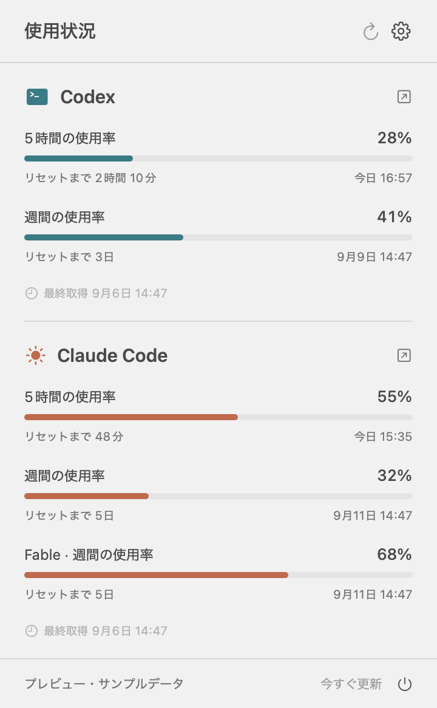

# Token Viewer

[English](README.md) · [ダウンロード](https://github.com/moguone/token_viewer/releases) · [開発への参加](CONTRIBUTING.md)

**Codex と Claude Code の使用率・リセット日時を Mac のメニューバーで確認するアプリ**です。Swift + SwiftUI 製。Apple Silicon、macOS 14 以降に対応しています。

メニューバーは幅 48pt の2行表示です。ノッチのある MacBook でも横幅を抑え、クリックすると各利用枠のバー、モデル別上限、リセット日時・残り時間、最終取得時刻を確認できます。



*画像はサンプルデータです。表示するのはサブスクリプションの利用上限に対する使用率です。生のトークン数や API 課金額ではありません。*

## 機能

- Codex と Claude Code をそれぞれ1行で表示。利用するサービスだけを有効にできます。
- 公式 CLI が返す期間・利用枠を表示。Codex の主要枠は必ずしも5時間ではなく、メニューバーにマウスを重ねると対象の枠を確認できます。
- Claude の Fable など、モデル別の週間上限を個別表示。CLI が返した場合のみ表示し、全体の使用率から推測しません。
- 英語・日本語に対応。表示言語を選択でき、日時と残り時間も各言語に合わせて表示します。
- 初期設定は5分ごとに更新。1・5・10・15分から選べ、スリープ中は停止、低電力モードやエラー時は間隔を延ばします。
- ログイン時の自動起動は任意。取得後は CLI を終了します。
- アプリ専用サーバー、アクセス解析、外部ライブラリは使いません。

## インストール

1. [Releases](https://github.com/moguone/token_viewer/releases) から `macOS-arm64.zip` を取得し、展開した **Token Viewer.app** を Applications に移動します。
2. 公式の [Codex CLI](https://developers.openai.com/codex/cli/) と [Claude Code](https://code.claude.com/docs/en/setup) のうち、利用するものをインストールします。先に Terminal でログインと初期設定を完了してください。利用枠を取得できるサブスクリプションが必要で、API キーの従量課金は対象外です。
3. Token Viewer を起動し、メニューバーの2行表示をクリックします。使わないサービスは設定で無効にできます。

一般的な CLI のインストール先を自動検出します。Codex アプリに同梱された CLI も利用できます。検出できない場合は設定で実行ファイルを選択するか、絶対パスを入力して Return を押してください。

**初回プレビュー版はアドホック署名で、Apple Developer ID による公証はされていません。** ダウンロードしたアプリが macOS にブロックされる場合があります。ソースを確認して自分でビルドする方法もあります。信頼するダウンロード済みアプリを開く場合は、Apple の[開発元未確認のアプリを開く手順](https://support.apple.com/ja-jp/102445)を参照してください。Gatekeeper 全体を無効化する必要はありません。

## データが表示されない場合・制約

- `—` は未取得・期限切れ・古いデータを表し、0% を意味しません。取得に失敗した場合、直前の成功データはパネル内に薄く表示し、古い情報であることを示します。
- Fable は Claude の `/usage` がモデル別の枠を返す場合のみ表示します。返されない場合はその旨を表示します。過去のトークンログから現在の利用上限を再現することはできません。
- Claude のステータスライン API は全体の5時間・7日間の枠のみを返すため、モデル別の枠は公式 `/usage` の表示から取得します。CLI の表示形式が変わると取得できなくなる可能性があります。`--safe-mode` と `--ax-screen-reader` に対応する新しい CLI が必要です。
- Codex の取得と Claude の未ログイン時の挙動は実環境で確認しています。Claude のログイン後の取得・Fable の解析は模擬 CLI とテストデータで確認していますが、**このプレビューでは認証済み Claude / Fable の実アカウント検証は未実施**です。
- 残り時間はパネルを開いている間、1分ごとに更新します。解析できないリセット日時は、CLI が返した文言をそのまま表示します。
- OpenAI・Anthropic の公式アプリではありません。サービス名は対応先を示すために使用しています。

## プライバシーと負荷

認証は公式 CLI が管理します。Token Viewer は認証トークン、API キー、ブラウザ Cookie、会話、過去のトークンログを読み取ったり送信したりしません。取得時の CLI 出力はメモリ内で解析し、アプリのデバッグログには保存しません。

使用率・利用枠のラベル・リセット日時・取得日時のみを `~/Library/Application Support/Token Viewer/Usage/` に保存します。ファイル権限は所有者のみです。設定は macOS 標準の設定保存領域を使います。公式 CLI 自身による認証情報・ローカルファイル・サービス通信の管理は引き続き行われます。

取得時だけ短時間 CLI を起動します。Codex は app-server の使用量読み取り、Claude は認証状態確認と専用ディレクトリでの `/usage` を使います。Claude は safe-mode などのオプションでツール、フック、MCP、プラグイン、自動更新を無効にします。モデルへのプロンプトや会話ターンは送信しません。取得処理にはタイムアウトがあり、終了・キャンセル時は自身が起動した子プロセスを停止します。取得の合間は次のイベントまでタイマーで待機します。

## ソースからビルド

Apple Silicon、macOS 14 以降、Xcode 16 以降 / Swift 6 が必要です。外部パッケージや Xcode プロジェクト生成は不要です。

```sh
git clone https://github.com/moguone/token_viewer.git
cd token_viewer
./scripts/test.sh
./scripts/package-app.sh
open "dist/Token Viewer.app"
```

パッケージ作成スクリプトは常に `arm64` でビルドし、アイコン生成・翻訳の同梱・署名の検証・ZIP と SHA-256 ファイルの生成を行います。ビルド成果物は Git の対象外です。

サンプルデータだけで画面を確認する場合:

```sh
swift run TokenViewer --demo --show-window --language ja
```

Developer ID 証明書と notarytool のプロファイルを持っている開発者は、以下のように独自の署名・公証を行えます。

```sh
CODE_SIGN_IDENTITY="Developer ID Application: Your Name (TEAMID)" \
NOTARY_PROFILE="your-notary-profile" \
VERSION="0.1.0" ./scripts/package-app.sh
```

テスト・翻訳追加・構成は [CONTRIBUTING.md](CONTRIBUTING.md) を参照してください。CI は push / Pull Request ごとにテストとビルドを行い、バージョンタグからプレビュー版を公開します。

## 参照・ライセンス

OpenAI の [app-server 使用量 API](https://learn.chatgpt.com/docs/app-server)、Anthropic の [`/usage` コマンド](https://code.claude.com/docs/en/commands)と[ステータスライン仕様](https://code.claude.com/docs/en/statusline)を利用しています。モデル別枠と全体枠の関係は [Fable のプラン別上限](https://support.claude.com/en/articles/15424964-claude-fable-models-on-your-plan)を参照してください。

[MIT License](LICENSE)。ソースコードと幾何学図形のアプリアイコンは本プロジェクトで作成しています。
