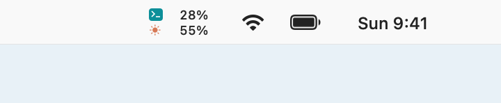

# Meterlet

[English](README.md) · [ダウンロード](https://github.com/moguone/meterlet/releases) · [開発への参加](CONTRIBUTING.md)

**メニューバーを見るだけで、Codex と Claude Code の使用率が分かる。**

Meterlet は、作業中も2つのサービスの使用率を表示する小さな Mac アプリです。Swift + SwiftUI 製。Apple Silicon、macOS 14 以降に対応しています。

<picture>
  <source media="(prefers-color-scheme: dark)" srcset="docs/images/menubar-dark.png">
  
</picture>

*上段が Codex、下段が Claude Code。アプリと同じ描画コードで作成したメニューバーの表示例です。数値はサンプルです。*

幅 **48pt** のコンパクトな2行表示で、ノッチのある MacBook でも横幅を抑えます。

**詳しく見たいときはクリック。** 各利用枠のバー、モデル別上限、リセット日時・残り時間、最終取得時刻を確認できます。


*画像はサンプルデータです。表示するのはサブスクリプションの利用上限に対する使用率です。生のトークン数や API 課金額ではありません。*

## 機能

- Codex と Claude Code をそれぞれ1行で表示。利用するサービスだけを有効にできます。
- 公式 CLI が返す期間・利用枠を表示。Codex の主要枠は必ずしも5時間ではなく、メニューバーにマウスを重ねると対象の枠を確認できます。
- Claude の Fable など、モデル別の週間上限を個別表示。CLI が返した場合のみ表示し、全体の使用率から推測しません。
- 英語・日本語に対応。表示言語を選択でき、日時と残り時間も各言語に合わせて表示します。
- 初期設定は5分ごとに更新。1・5・10・15分から選べ、スリープ中は停止、低電力モードやエラー時は間隔を延ばします。
- ログイン時の自動起動は任意。取得後は CLI を終了します。
- アプリ専用サーバー、アクセス解析は使いません。アプリ更新には [Sparkle](https://sparkle-project.org/) を使います。

## インストール

1. [Releases](https://github.com/moguone/meterlet/releases) から `macOS-arm64.zip` を取得し、展開した **Meterlet.app** を Applications に移動します。
2. 下記の説明に沿って、利用するサービスを設定します。デスクトップ版の実行プログラム、または別途インストールした公式 CLI を利用できます。利用枠を取得できるサブスクリプションが必要で、API キーの従量課金は対象外です。
3. Meterlet を起動し、メニューバーの2行表示をクリックします。使わないサービスは設定で無効にできます。

**Codex:** ChatGPT / Codex デスクトップアプリ内の CLI を利用でき、CLI の追加インストールは不要です。macOS に登録されていれば、アプリ名や配置を変更した場合も検出します。認証が必要な場合は「ターミナルでセットアップ」から公式プログラムのログインを行います。

**Claude:** デスクトップ版が Code 機能の実行プログラムをダウンロード済みであれば、CLI の追加インストールは不要です。まず Claude の **Code** 機能の初期設定を完了してください。デスクトップ版にログイン済みでも、単独で起動した実行プログラムには別途認証が必要な場合があります。表示された場合は「ターミナルでセットアップ」で Claude Code のログインと初期設定を行います。Meterlet がデスクトップ版の認証情報を取り出すことはありません。Code の実行プログラムがないチャット専用のインストールでは取得できません。[Claude Code CLI](https://code.claude.com/docs/en/setup) の別途インストールも利用できます。

手動指定した実行ファイルは固定して使います。自動検出では CLI を先に試し、見つからない場合、または認証エラーの場合にデスクトップ版の実行プログラムを試します。通信障害・レート制限・初期設定不足・表示形式の不一致では切り替えません。両方とも認証できなければ、両方を試した後でログイン案内を表示します。デスクトップ版の実行プログラムが利用できる認証を使い、デスクトップアプリから認証情報を取り出して渡すことはしません。Claude の同梱プログラムは取得のたびに利用可能な最新バージョンを探し、VM 用のプログラムは使用しません。自動検出できない場合は設定で実行ファイルを選択するか、絶対パスを入力して Return で確定してください。同梱プログラムの配置は公式アプリの内部仕様であり、今後の変更に追従が必要な場合があります。

**配布用アプリは Developer ID の署名・Apple の公証を確認してから公開します。** CI の成果物と通常のローカルビルドは、開発確認用のアドホック署名です。ダウンロードした開発用ビルドは macOS にブロックされる場合があります。ソースからのビルドも利用できます。配布用アプリは [Releases](https://github.com/moguone/meterlet/releases) から取得できます。

メニューバー項目を右クリックすると、使用状況・設定・更新の確認・終了を選べます。Meterlet がアクティブな間は **⌘1** で使用状況の開閉、**⌘,** で設定、**⌘Q** で終了できます。更新時は旧バージョンを終了してからアプリを置き換えてください。別フォルダのコピーを開いても、常駐するのは1つだけです。

## アプリの更新

メニューバーの右クリック、または設定から **「更新を確認…」** を選びます。**「アップデートを自動で確認」** を有効にすると1日ごとに確認します（初期状態は無効）。ダウンロード・インストールは更新内容を確認してから実行し、無断での自動インストールは行いません。

GitHub の最新の通常リリースに添付した、署名付き `appcast.xml` を参照します。下書きとプレリリースは対象外です。Sparkle が更新情報と配布ファイルの署名を検証した後、アプリを置き換えて再起動します。ダウンロードの中断や署名検証の失敗では、現在のアプリを維持します。

この機能が入る最初のバージョンだけは手動での入れ替えが必要です。アプリ内更新を使う前に Meterlet を Applications に移動してください。開発時は `OUTPUT_DIR=.build/candidate ./scripts/package-app.sh` で別フォルダへビルドできます。実行中のアプリへの上書きはスクリプトで防ぎます。

更新確認では、更新情報と配布ファイルを取得するため GitHub に通信します。使用率や CLI の認証情報は送信しません。Sparkle のシステム情報収集は無効です。

## データが表示されない場合・制約

- `—` は未取得・期限切れ・古いデータを表し、0% を意味しません。取得に失敗した場合、直前の成功データはパネル内に薄く表示し、古い情報であることを示します。
- Fable は Claude の `/usage` がモデル別の枠を返す場合のみ表示します。返されない場合はその旨を表示します。過去のトークンログから現在の利用上限を再現することはできません。
- Claude のステータスライン API は全体の5時間・7日間の枠のみを返すため、モデル別の枠は公式 `/usage` の表示から取得します。CLI の表示形式が変わると取得できなくなる可能性があります。`--safe-mode` と `--ax-screen-reader` に対応する新しい CLI が必要です。
- Codex の取得、Claude の未ログイン時の挙動、Claude のログイン後の `/usage` 取得は実環境（Claude Code 2.1.273、Claude Max アカウント）で確認しています。Fable の解析はテストデータで確認しており、CLI がモデル別の枠を `/usage` に含める場合に表示されます。
- 残り時間はパネルを開いている間、1分ごとに更新します。解析できないリセット日時は、CLI が返した文言をそのまま表示します。
- OpenAI・Anthropic の公式アプリではありません。サービス名は対応先を示すために使用しています。

## プライバシーと負荷

認証は公式 CLI が管理します。Meterlet は認証トークン、API キー、ブラウザ Cookie、会話、過去のトークンログを読み取ったり送信したりしません。取得時の CLI 出力はメモリ内で解析し、アプリのデバッグログには保存しません。

使用率・利用枠のラベル・リセット日時・取得日時のみを `~/Library/Application Support/Meterlet/Usage/` に保存します。ファイル権限は所有者のみです。設定は macOS 標準の設定保存領域を使います。公式 CLI 自身による認証情報・ローカルファイル・サービス通信の管理は引き続き行われます。

取得時だけ短時間 CLI を起動します。Codex は app-server の使用量読み取り、Claude は認証状態確認と専用ディレクトリでの `/usage` を使います。Claude は safe-mode などのオプションでツール、フック、MCP、プラグイン、自動更新を無効にします。モデルへのプロンプトや会話ターンは送信しません。取得処理にはタイムアウトがあり、終了・キャンセル時は自身が起動した子プロセスを停止します。取得の合間は次のイベントまでタイマーで待機します。

## ソースからビルド

Apple Silicon、macOS 14 以降、Xcode 16 以降 / Swift 6 が必要です。Sparkle は Swift Package Manager が取得します。Xcode プロジェクトの生成は不要です。

```sh
git clone https://github.com/moguone/meterlet.git
cd meterlet
./scripts/test.sh
./scripts/package-app.sh
open "dist/Meterlet.app"
```

パッケージ作成スクリプトは常に `arm64` でビルドし、アイコン生成・翻訳の同梱・署名の検証・ZIP と SHA-256 ファイルの生成を行います。ビルド成果物は Git の対象外です。

サンプルデータだけで画面を確認する場合:

```sh
swift run Meterlet --demo --show-window --language ja
```

Developer ID 証明書と notarytool のプロファイルを持っている開発者は、以下のように独自の署名・公証を行えます。

```sh
CODE_SIGN_IDENTITY="Developer ID Application: Your Name (TEAMID)" \
NOTARY_PROFILE="your-notary-profile" \
VERSION="0.2.0" ./scripts/package-app.sh
```

テスト・翻訳追加・構成は [CONTRIBUTING.md](CONTRIBUTING.md) を参照してください。CI は push / Pull Request ごとにテストとビルドを行い、バージョンタグからリリースの下書きを作成します。署名・公証の確認後に公開する手順は[配布ガイド](docs/RELEASING.md)を参照してください。

## 参照・ライセンス

OpenAI の [app-server 使用量 API](https://learn.chatgpt.com/docs/app-server)、Anthropic の [`/usage` コマンド](https://code.claude.com/docs/en/commands)と[ステータスライン仕様](https://code.claude.com/docs/en/statusline)を利用しています。モデル別枠と全体枠の関係は [Fable のプラン別上限](https://support.claude.com/en/articles/15424964-claude-fable-models-on-your-plan)を参照してください。

[MIT License](LICENSE)。ソースコードと幾何学図形のアプリアイコンは本プロジェクトで作成しています。

Sparkle と同梱コンポーネントのライセンスは [サードパーティーの権利表記](THIRD_PARTY_NOTICES.md) に記載しています。
