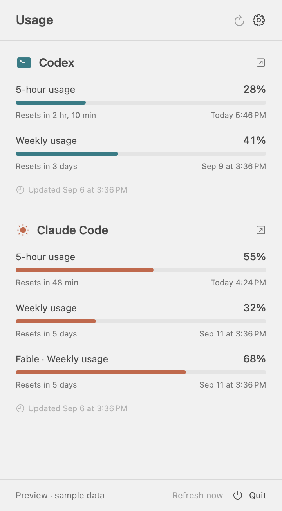

# Meterlet

[日本語](README.ja.md) · [Download](https://github.com/moguone/meterlet/releases) · [Contributing](CONTRIBUTING.md)

A small native macOS menu bar app for **Codex and Claude Code usage limits and reset times**. Built with Swift and SwiftUI, for Apple Silicon on macOS 14 or later.

Two compact rows fit into a fixed 48-point menu bar item, leaving more room beside the MacBook notch. Click it to see each usage window, model-specific limits, reset time, countdown, and last successful fetch.



*Screenshot uses sample data. Percentages mean the share of a subscription usage limit consumed; this is not a raw token counter or an API billing meter.*

## What it does

- Shows Codex and Claude Code on separate menu bar rows, or just the provider you enable.
- Displays the usage windows actually reported by the official CLIs. Codex's primary window is not always five hours; hover over the menu item to identify it.
- Shows Claude's Fable and other model-specific weekly limits **when reported**, without inferring them from the overall quota.
- Includes English and Japanese, with a language selector and localized dates and countdowns.
- Checks every five minutes by default. Choose 1, 5, 10, or 15 minutes; checks pause during sleep and slow down in Low Power Mode or after errors.
- Offers optional launch at login. No background CLI is kept running between checks.
- Runs locally, without an application server or analytics. [Sparkle](https://sparkle-project.org/) handles app updates.

## Install and set up

1. Download the `macOS-arm64.zip` from [Releases](https://github.com/moguone/meterlet/releases), unzip it, and move **Meterlet.app** to Applications.
2. Set up the providers you use, as described below. Meterlet can use their desktop runtimes or separately installed official CLIs. A supported subscription and available quota information are required; API-key billing is not supported.
3. Open Meterlet and click its two-line menu item. Turn off any provider you do not use in Settings.

Right-click the menu bar item for Usage, Settings, Check for Updates, and Quit. While Meterlet is active, use **⌘1** to open or close usage, **⌘,** for Settings, or **⌘Q** to quit. Before replacing an older version, quit it first. Only one copy stays running, even if you open the app from another folder.

**Codex:** Meterlet can use the CLI inside the ChatGPT or Codex desktop app. It also discovers renamed or relocated apps registered with macOS. A separate Codex CLI install is optional. If sign-in is required, choose **Set up in Terminal** to use the official program’s sign-in flow.

**Claude:** Once Claude desktop has downloaded its Code runtime, Meterlet can use it without a separate CLI install. Open the **Code** feature and complete its setup first. Desktop sign-in does not guarantee the runtime is signed in when launched separately; if prompted, use **Set up in Terminal** to finish Claude Code’s sign-in and initial setup. Meterlet does not extract the desktop app’s credentials. A chat-only installation with no downloaded Code runtime is insufficient. Separately installing [Claude Code CLI](https://code.claude.com/docs/en/setup) is also supported.

A manually selected executable is fixed. Automatic detection tries the installed CLI first, then the desktop runtime if the CLI is missing or returns an authentication error. Network failures, rate limits, setup errors, and unrecognized output do not trigger a switch. If both installations require sign-in, Meterlet shows the sign-in error after trying both. The desktop runtime uses its own available authentication; Meterlet does not transfer credentials from the desktop app. Claude’s newest executable native desktop runtime is selected on each check; its VM runtime is excluded. If detection fails, choose the executable in Settings, or enter its absolute path and press Return. Desktop runtime locations are implementation details of the official apps and may change in future versions.

**Official downloads are published after Developer ID signing and Apple notarization.** CI artifacts and default local builds are ad-hoc-signed development builds. macOS may block downloaded development builds; you can build the source locally. Get verified distribution builds from [Releases](https://github.com/moguone/meterlet/releases).

## App updates

Choose **Check for Updates…** from the menu bar’s right-click menu or Settings. Enable **Check for updates automatically** to check once a day (off by default). Each update requires your choice to download and install; automatic silent installation is disabled.

Updates use the signed `appcast.xml` attached to the latest normal GitHub release. Drafts and prereleases are excluded. Sparkle verifies the update feed and archive signatures before installing, then replaces and relaunches Meterlet. An interrupted download or a failed signature check leaves the installed app in place.

The first version with this feature must be installed manually; earlier versions cannot update themselves. Move Meterlet to Applications before using in-app updates. For development builds, use `OUTPUT_DIR=.build/candidate ./scripts/package-app.sh` to leave an existing build untouched. Packaging refuses to replace a running app.

## Missing data and limitations

- `—` means unavailable, expired, or stale data. It does **not** mean 0%. A failed check keeps the last successful snapshot in the panel, dimmed and labeled as old.
- Fable appears only when Claude's `/usage` command returns a model-specific section. Missing Fable data is identified explicitly. Historical token logs cannot reconstruct the current subscription quota.
- Claude's collector uses the official interactive `/usage` output because the status-line API only exposes the general five-hour and seven-day windows. This text format can change. A recent CLI supporting `--safe-mode` and `--ax-screen-reader` is required; update the CLI if prompted.
- Codex fetching and Claude's logged-out behavior have been tested against the installed CLIs. Claude's authenticated flow and Fable parsing are covered by simulated CLI processes and fixtures; **live authenticated Claude/Fable validation remains outstanding** for this preview.
- The displayed countdown advances once a minute while the panel is open. Unrecognized CLI reset text is shown as reported, without an invented date.
- This independent project is not affiliated with OpenAI or Anthropic. Provider names identify the services it supports.

## Privacy and resource use

Authentication stays in the official CLIs. Meterlet does not read or export auth tokens, API keys, browser cookies, conversations, or historical token logs. CLI output is parsed in memory and is not written to debug logs by the app.

Only normalized percentages, window labels, reset times, and fetch timestamps are cached in `~/Library/Application Support/Meterlet/Usage/`, with owner-only file permissions. Preferences are stored in the app's standard macOS defaults. The official CLIs continue to manage their own authentication, local files, and service connections. App update checks contact GitHub for release information and downloads; usage data and CLI credentials are not included. Sparkle system profiling is disabled.

During a check, Codex receives an app-server usage read; Claude receives an auth-status check and `/usage` in a private probe directory, with tools, hooks, MCP, plugins, and auto-updating disabled by its safe-mode options. No model prompt or chat turn is submitted. Each probe has a timeout, and its own subprocesses are stopped after completion or cancellation. Between checks, a one-shot timer waits for the next scheduled event.

## Build from source

Requires Apple Silicon, macOS 14+, and Xcode 16+ / Swift 6. Swift Package Manager fetches the pinned Sparkle framework; no Xcode project generation is needed.

```sh
git clone https://github.com/moguone/meterlet.git
cd meterlet
./scripts/test.sh
./scripts/package-app.sh
open "dist/Meterlet.app"
```

The packaging script always builds `arm64`, generates the app icon, bundles translations, verifies its code signature, and creates a ZIP plus a SHA-256 file. Build outputs are ignored by Git.

For a development preview using sample data only:

```sh
swift run Meterlet --demo --show-window --language en
```

Developers with an Apple Developer ID certificate and configured notarytool profile can sign and notarize their own distribution:

```sh
CODE_SIGN_IDENTITY="Developer ID Application: Your Name (TEAMID)" \
NOTARY_PROFILE="your-notary-profile" \
VERSION="0.2.0" ./scripts/package-app.sh
```

See [CONTRIBUTING.md](CONTRIBUTING.md) for tests, translations, and the project layout. CI builds and tests every push and pull request; version tags prepare draft releases. Signed distribution is verified before publication; see [the release guide](docs/RELEASING.md).

## References and license

The integrations use OpenAI's [app-server account usage API](https://learn.chatgpt.com/docs/app-server), Anthropic's [`/usage` command](https://code.claude.com/docs/en/commands), and its documented [status-line fields](https://code.claude.com/docs/en/statusline). See Anthropic's [Fable plan limits](https://support.claude.com/en/articles/15424964-claude-fable-models-on-your-plan) for how model-specific allowances relate to the overall limit.

[MIT](LICENSE). The app source and geometric artwork are original to this project. Sparkle and its bundled components are covered by [third-party notices](THIRD_PARTY_NOTICES.md).
